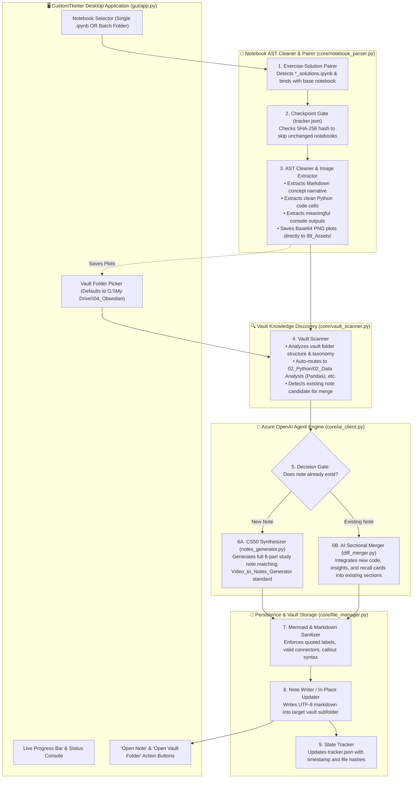

# 🧠 Colab-to-Obsidian AI Knowledge Agent — Architectural Blueprint & Plan

> **Project Root**: `D:\01_Ex_Files_Intermediate_SQL_for_Data_Scientists\V_Colab-to-Obsidian Notes`  
> **Source Material**: Google Colab / Jupyter Notebooks (`.ipynb`) in Local Drive / Course Directories  
> **Target Vault**: Obsidian Knowledge Base at `G:\My Drive\04_Obsedian\`  
> **Model Provider**: Azure OpenAI (GPT-4o / GPT-4o-mini deployment configured in `.env`)  
> **Pedagogy Standard**: Harvard CS50 Instructional Methodology (Concept Before Syntax, Intuitive Mental Models, Active Recall)  
> **Note Structure Standard**: Identical to `Video_to_Notes_Generator` (TOC, Callouts, Sanitized Mermaid, Cheatsheet, Collapsible Active Recall)

---

## 🎯 1. Executive Summary & Vision

The objective of this project is to build an autonomous, quota-resilient **Desktop GUI Application** (matching the modern dark-themed look & feel of `Video_to_Notes_Generator`) that ingests **Jupyter / Google Colab notebooks (`.ipynb`)** and converts what you learned into **gold-standard, permanent Obsidian study notes**.

### Key Differentiators:
1. **Desktop GUI Experience**: Built with CustomTkinter featuring file/folder browse buttons, auto-detected target folders, live processing logs, progress bar, and "Open Note" / "Open Folder" action buttons.
2. **Dual-Ingestion Notebook Pairing**: Automatically recognizes paired problem and solution notebooks (e.g. `section01_NumPy.ipynb` + `section01_NumPy_solutions.ipynb`) and merges them into a single, cohesive study guide with complete exercises and explanations.
3. **Identical Note Schema to Video_to_Notes_Generator**: Strictly adheres to the 8-part Obsidian note architecture (YAML Frontmatter, Executive Abstract & Metadata Card, Clickable Obsidian TOC, Related Topics Concept Graph with `[[WikiLinks]]`, Deep-Dive CS50 Notes with standalone code blocks, Quick Reference Cheatsheet & Table, Collapsible `> [!question]-` Active Recall Flashcards, and Summing Up).
4. **Smart Image & Plot Pipeline**: Extracts embedded Matplotlib/Seaborn base64 charts from notebooks and persists them directly into `G:\My Drive\04_Obsedian\99_Assets\` using the vault's asset naming format (`[Topic]_[Hash].png`), embedding them with `![[image.png]]` syntax alongside their generating code.
5. **Intelligent In-Place Merge**: Checks the target vault before writing. If a note on the topic exists, an AI-powered sectional merger weaves new insights, code examples, and flashcards into existing sections without destroying custom edits or existing `[[WikiLinks]]`.
6. **Stateful Checkpointing**: Uses `tracker.json` with SHA-256 notebook hashes to prevent redundant API token consumption.

---

## 🏗️ 2. End-to-End System Architecture



---

## 🏛️ 3. Standard Note Structure (Matching Video_to_Notes_Generator)

Every note generated or merged strictly matches the proven format from `D:\01_Ex_Files_Intermediate_SQL_for_Data_Scientists\Video_to_Notes_Generator`:

```markdown
---
title: "NumPy Vectorization & Multi-Dimensional Slicing"
topic: "Python | Data Analysis"
difficulty: "Intermediate"
skills:
  - "Multi-dimensional array slicing and indexing"
  - "Vectorized operations and boolean masking"
  - "Memory layouts: Views vs Copies in NumPy"
tags:
  - "numpy"
  - "vectorization"
  - "data-analysis"
  - "python-arrays"
source: "Colab Notebook"
source_file: "section01_NumPy_solutions.ipynb"
created: "2026-09-27"
---

# NumPy Vectorization & Multi-Dimensional Slicing

> [!ABSTRACT] Executive Summary
> Concise 2-3 sentence overview explaining what this notebook covers, why memory contiguous arrays enable SIMD vectorization, and the core problems solved.

| Metadata | Details |
|---|---|
| **Domain / Category** | `Python | Data Analysis` |
| **Difficulty** | `Intermediate` |
| **Core Competencies** | `Vectorization`, `Array Slicing`, `Broadcasting` |
| **Target Tools / Tech** | `NumPy`, `Google Colab`, `Python 3.11` |

### 📑 Clickable Table of Contents
- [[#🔗 Related Topics & Concept Graph]]
- [[#1. Building Intuition: Contiguous Memory vs Python Lists]]
- [[#2. Multi-Dimensional Array Slicing & Strides]]
- [[#3. Visualizing Array Broadcasts]]
- [[#⚡ Quick Reference & Cheat Sheet]]
- [[#❓ Active Recall & Practice Questions]]
- [[#🏁 Summing Up]]

### 🔗 Related Topics & Concept Graph (Obsidian [[WikiLinks]])
- [[01_Python Memory Model]] — Explains pointer indirection vs flat buffers.
- [[02_Pandas Series & DataFrames]] — How NumPy 2D ndarrays form the foundation of DataFrame internals.
- [[03_Broadcasting Rules]] — Element-wise arithmetic across disparate dimensions.

## 1. Building Intuition: Contiguous Memory vs Python Lists
Detailed mental model explaining pointers vs contiguous memory buffers.

```python
# Create 5x2 array of multiples of 10
import numpy as np

arr = np.arange(10, 101, 10).reshape(5, 2)
print(arr.shape)  # Output: (5, 2)
print(arr.dtype)  # Output: int64
```

> [!NOTE] Memory Layout
> NumPy stores elements in a single contiguous block of C-order memory, eliminating Python object pointer overhead.

## 2. Visualizing Array Transformations
![[NumPy_Vectorization_&_Multi-Dimensional_Slicing_470321.png]]

```mermaid
flowchart TD
    A["1D Array: shape (10,)"] -->|reshape(5, 2)| B["2D Array: shape (5, 2)"]
    B -->|boolean mask arr > 50| C["Filtered Sub-array"]
```

> [!WARNING] Views vs Copies
> Slicing an ndarray returns a memory view, not a deep copy. Modifying the slice mutates the original array!

### ⚡ Quick Reference & Cheat Sheet
```python
# Consolidated essential syntax
arr = np.arange(0, 100, 10)
filtered = arr[arr > 40]
ternary = np.where(arr % 20 == 0, 1, 0)
```

| Action / Task | Command / Syntax | Purpose / Gotcha |
| :--- | :--- | :--- |
| `Reshape array` | `arr.reshape(r, c)` | Views array with new shape (must match total elements) |
| `Boolean mask` | `arr[condition]` | Extracts 1D array of elements matching predicate |
| `Conditional selection` | `np.where(cond, x, y)` | Vectorized if-else replacement |

### ❓ Active Recall & Practice Questions
> [!question]- 1. What is the fundamental difference between np.arange() and np.linspace()?
> **Answer:**
> `np.arange(start, stop, step)` generates elements based on a defined step interval, whereas `np.linspace(start, stop, num)` generates an exact number of evenly spaced points over a specified closed interval.

> [!question]- 2. Why does modifying a slice of an ndarray affect the original array?
> **Answer:**
> NumPy slices return views that share the exact same underlying memory buffer using stride arithmetic, rather than allocating a new memory copy.

### 🏁 Summing Up
- NumPy's vectorized C-buffers bypass Python GIL and object-boxing overhead.
- Array reshaping and basic slicing create views; use `.copy()` when mutation isolation is required.
- Broadcasting aligns dimensions dynamically, eliminating explicit nested loops in numerical processing.
```

---

## 🗂️ 4. Directory & Module Plan

```text
V_Colab-to-Obsidian Notes/
├── PLAN.md                     # Architectural blueprint & specification
├── main.py                     # Entry point — initializes environment & launches CustomTkinter GUI
├── config.json                 # Persisted GUI preferences (vault path, last selected folder)
├── tracker.json                # State machine: stores notebook SHA-256 hashes & note links
├── requirements.txt            # customtkinter, openai, nbformat, python-dotenv
├── .env.example                # Azure OpenAI configuration template
├── .env                        # Local deployment credentials (loaded from parent or local)
│
├── core/
│   ├── __init__.py             # Package marker
│   ├── ai_client.py            # Azure OpenAI client with retry logic & token quota management
│   ├── notebook_parser.py      # Cleans .ipynb AST, pairs exercises/solutions, extracts base64 PNGs
│   ├── vault_scanner.py        # Indexes vault taxonomy (02_Python/...) and detects existing notes
│   ├── notes_generator.py      # Prompts adhering to Video_to_Notes_Generator schema & sanitizers
│   ├── diff_merger.py          # AI-powered sectional merger for existing notes
│   └── file_manager.py         # Frontmatter injection, safe file saving, and image asset storage
│
└── gui/
    ├── __init__.py             # GUI package marker
    └── app.py                  # CustomTkinter responsive GUI application
```

---

## 🚦 5. Implementation Roadmap

### Phase 1: Environment & Core Foundation
- Setup virtual environment and copy/confirm Azure OpenAI `.env` credentials.
- Build `core/ai_client.py` using `openai.AzureOpenAI` with token controls and error handling.
- Build `core/notebook_parser.py`:
  - AST cleaner for `.ipynb` (extracts markdown, clean code, text outputs).
  - Base64 image extractor (detects plots and prepares them for `99_Assets`).
  - Dual-ingestion detector (pairs `xyz.ipynb` with `xyz_solutions.ipynb`).

### Phase 2: Vault Scanner & Asset Pipeline
- Build `core/vault_scanner.py` to index `G:\My Drive\04_Obsedian` and suggest target subfolders (`02_Python/01_Core Python`, `02_Python/02_Data Analysis (Pandas)`).
- Implement `core/file_manager.py`:
  - Save extracted plots into `G:\My Drive\04_Obsedian\99_Assets\` with `[Topic]_[Hash].png` convention.
  - Manage YAML frontmatter and file creation.

### Phase 3: Generator & In-Place Sectional Merger
- Implement `core/notes_generator.py`:
  - System prompt enforcing the exact `Video_to_Notes_Generator` 8-part schema.
  - Mermaid diagram sanitizer (quoted node labels, valid edge connectors).
  - Collapsible callout formatting for Active Recall questions.
- Implement `core/diff_merger.py`:
  - AI sectional merge prompt to weave new concepts into existing notes without breaking user notes or links.

### Phase 4: Desktop GUI (CustomTkinter)
- Build `gui/app.py`:
  - Dual input selector: Single `.ipynb` file picker OR entire folder batch picker.
  - Smart vault selector with auto-suggested subfolder and browse button.
  - Batch progress bar, live scrolling status console, and threading to keep GUI responsive.
  - Completion dialog with "Open Note" and "Open Vault Folder" buttons.
- Build `main.py` entry point with pre-flight configuration check.

### Phase 5: Verification & End-to-End Test
- Test on sample notebooks in the workspace (e.g. NumPy / Pandas course notebooks).
- Verify note structure in Obsidian, clickable TOC, valid Mermaid diagrams, embedded image assets, and collapsible questions.
