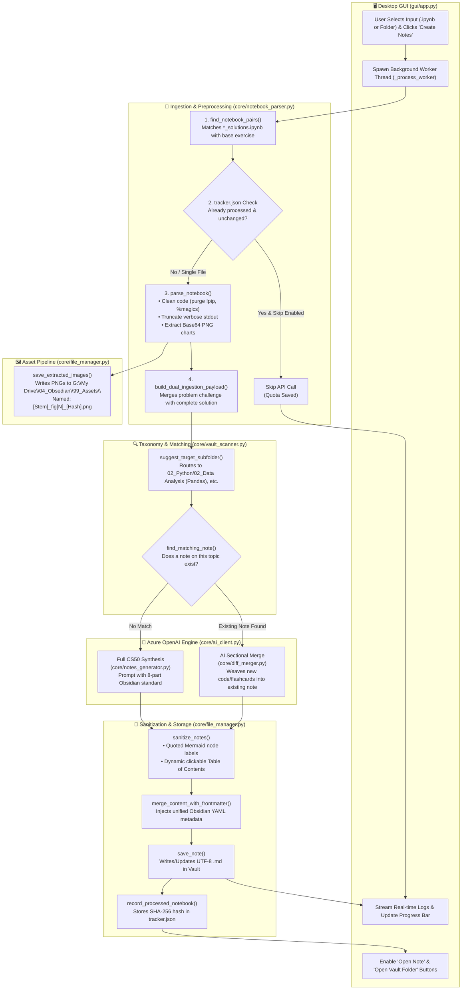
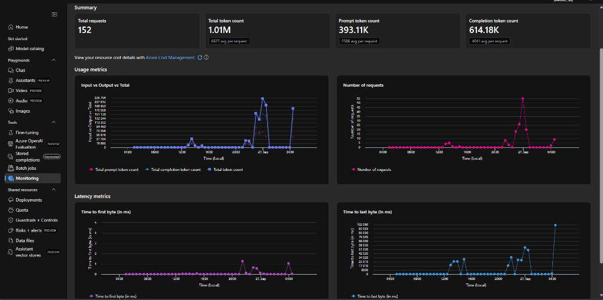

# 🧠 Colab-to-Obsidian AI Knowledge Agent

> **Turn Google Colab & Jupyter Notebooks into permanent, CS50-grade Obsidian study notes.**  
> Built with CustomTkinter, Azure OpenAI (`gpt-5-mini`), and modern Personal Knowledge Management (PKM) standards.

---

## 🌟 Key Features

1. **CustomTkinter Desktop Application**:
   - Modern dark-themed UI matching `Video_to_Notes_Generator`.
   - Dual Input Modes: **Single Notebook (`.ipynb`)** or **Recursive Batch Folder**.
   - Live progress bar, status notifications, and scrolling console.
   - **Open Note** & **Open Vault Folder** action buttons upon completion.

2. **Dual-Ingestion Notebook Pairing**:
   - Automatically detects companion problem and solution notebooks (e.g. `section01_NumPy.ipynb` + `section01_NumPy_solutions.ipynb`).
   - Unifies student challenge prompts with complete implementations into a single comprehensive note.

3. **8-Part Obsidian Study Note Standard**:
   - **YAML Frontmatter**: Dataview compatible (`title`, `topic`, `difficulty`, `skills`, `tags`, `source`, `source_file`, `created`).
   - **Title & Executive Metadata Card**: Abstract callout (`> [!ABSTRACT]`) and domain competency table.
   - **📑 Clickable Table of Contents**: Dynamic `[[#Exact Heading Title]]` links.
   - **🔗 Related Topics Concept Graph**: Curated `[[WikiLinks]]`.
   - **📖 Deep-Dive CS50 Study Notes**: Conceptual intuition before syntax, standalone fenced code blocks with outputs, and sanitized Mermaid diagrams.
   - **⚡ Quick Reference & Cheat Sheet**: Consolidated code block + scannable reference table.
   - **❓ Active Recall & Practice Questions**: Collapsible callouts (`> [!question]- 1. ...?`).
   - **🏁 Summing Up**: Bulleted key takeaways.

4. **Matplotlib & Seaborn Asset Pipeline**:
   - Automatically extracts embedded Base64 PNG plots.
   - Saves figures directly into your vault at `G:\My Drive\04_Obsedian\99_Assets\` using unique hashes (`[Stem]_fig[N]_[Hash].png`).
   - Embeds figures cleanly via `![[image.png]]` syntax alongside their generating code.

5. **Intelligent In-Place Sectional Merge**:
   - Scans your Obsidian vault for matching topic notes.
   - If an existing note is found, an AI-powered sectional merge weaves new concepts, code, and flashcards into existing sections without losing custom notes or links.

6. **Stateful Checkpointing**:
   - Maintains `tracker.json` with SHA-256 hashes to prevent redundant API token consumption.

---

## 🔄 End-to-End Code Execution Flow

The following diagram illustrates the complete runtime lifecycle from user click to Obsidian note persistence:



### Detailed Lifecycle Steps:
1. **Selection & Dispatch**: User picks a notebook file or folder in CustomTkinter. The UI validates paths and launches a non-blocking daemon thread so the interface never freezes.
2. **Dual-Ingestion Pairing**: The parser inspects filenames. If `section01_NumPy.ipynb` and `section01_NumPy_solutions.ipynb` are both present, they are bundled together.
3. **AST Cleaning & Plot Extraction**: The cleaner traverses notebook cells via `nbformat`. Ephemeral commands (`!pip`, `%matplotlib inline`) are commented out, large array outputs are truncated, and embedded Base64 PNG plots are decoded and saved directly into `99_Assets/`.
4. **Knowledge Discovery & Routing**: The vault scanner identifies the subject matter and routes the destination to the corresponding folder (e.g. `02_Python/02_Data Analysis (Pandas)`). It then performs fuzzy title and topic matching against existing notes.
5. **AI Synthesis / Sectional Merge**:
   - If an existing note is found: Azure OpenAI (`gpt-5-mini`) performs a non-destructive merge, weaving in new code, diagrams, and flashcards while preserving custom user text and `[[WikiLinks]]`.
   - If no note exists: Azure OpenAI synthesizes a brand-new study note following the 8-part CS50 schema.
6. **Sanitization & Writing**: The generated markdown passes through `sanitize_notes` to guarantee valid Mermaid syntax (double-quoted node labels, cleaned connectors) and injects a dynamic clickable Table of Contents linking directly to all headings.
7. **State Tracking**: File hashes and output paths are written to `tracker.json` to prevent re-processing in subsequent runs.

---

## 🗂️ Descriptive File & Module Breakdown

Below is a detailed guide to every file in the codebase and its exact responsibility:

```text
V_Colab-to-Obsidian Notes/
├── PLAN.md                     # Master architectural specification, decisions & roadmap
├── README.md                   # Complete documentation, execution flow & user guide
├── main.py                     # Primary desktop launcher with pre-flight .env validator
├── config.json                 # Persisted GUI user preferences (last vault & notebook paths)
├── tracker.json                # State machine: stores notebook SHA-256 hashes to prevent re-runs
├── requirements.txt            # Python dependencies (customtkinter, openai, nbformat, python-dotenv)
├── .env.example                # Template of required Azure OpenAI environment variables
├── .env                        # Local Azure OpenAI deployment secrets (git-ignored)
├── .gitignore                  # Git exclusion rules for .venv, .env, and caches
│
├── core/
│   ├── __init__.py             # Package marker for core modules
│   ├── ai_client.py            # Azure OpenAI SDK wrapper with retry logic & reasoning controls
│   ├── notebook_parser.py      # AST cleaner, image extractor & exercise-solution pairer
│   ├── vault_scanner.py        # Obsidian vault taxonomy indexer & fuzzy note matcher
│   ├── notes_generator.py      # Master CS50 prompt definitions, Mermaid sanitizer & TOC builder
│   ├── diff_merger.py          # AI sectional merge engine for updating existing notes
│   └── file_manager.py         # YAML frontmatter injection, asset writer & state tracker
│
├── gui/
│   ├── __init__.py             # Package marker for GUI components
│   └── app.py                  # CustomTkinter responsive desktop GUI application
│
└── tests/
    ├── test_phase1.py          # Automated verification for AST parser & Azure OpenAI connectivity
    ├── test_phase2.py          # Automated verification for Vault taxonomy, routing & asset saving
    └── test_phase3.py          # Automated verification for CS50 note synthesis & in-place merge
```

### Detailed File Responsibilities:

#### `main.py`
- **Purpose**: Application entry point.
- **Key Functions**:
  - `check_environment()`: Verifies that required Azure OpenAI environment variables (`AZURE_OPENAI_ENDPOINT`, `AZURE_OPENAI_KEY`, `AZURE_OPENAI_DEPLOYMENT`) exist in `.env`.
  - `main()`: Reports missing keys with clear setup instructions, then launches `gui.app.launch_app()`.

#### `core/notebook_parser.py`
- **Purpose**: Ingestion engine that parses `.ipynb` files into structured, token-efficient representations.
- **Key Classes & Functions**:
  - `ExtractedImage`: Encapsulates extracted plot bytes, asset filename, cell index, and metadata.
  - `clean_source_code(source)`: Strips notebook noise (`!pip install`, `%magics`) while preserving code logic.
  - `truncate_output_text(text)`: Truncates massive console dumps and array outputs to preserve token budget.
  - `parse_notebook(path)`: Traverses AST cells, decodes embedded Base64 PNG plots, and returns clean cell dictionaries.
  - `find_notebook_pairs(file_paths)`: Identifies companion problem (`.ipynb`) and solution (`_solutions.ipynb`) notebooks.
  - `build_dual_ingestion_payload(ex_data, sol_data)`: Combines problem statements and full solutions into a unified prompt payload.

#### `core/ai_client.py`
- **Purpose**: Robust client interface to Azure OpenAI.
- **Key Features**:
  - Automatically targets deployments (e.g. `gpt-5-mini` with 420K TPM).
  - Adapts to reasoning models with `AZURE_OPENAI_REASONING_EFFORT` (high/medium/low) and `max_completion_tokens`.
  - Implements exponential backoff on HTTP 429 rate limits with live UI status notifications.

#### `core/vault_scanner.py`
- **Purpose**: Inspects the Obsidian vault to ensure organized filing and avoid duplicate notes.
- **Key Functions**:
  - `get_vault_subfolders(vault_path)`: Recursively indexes all non-hidden folders in `G:\My Drive\04_Obsedian`.
  - `suggest_target_subfolder(vault_path, title, preview)`: Keyword-driven auto-router that maps notebooks into `02_Python/02_Data Analysis (Pandas)`, `02_Python/01_Core Python`, `01_SQL/01_Concepts`, etc.
  - `find_matching_note(title, target_folder)`: Fuzzy Jaccard matcher that detects whether a note covering the same topic already exists in the folder.

#### `core/notes_generator.py`
- **Purpose**: Enforces educational pedagogy, Obsidian formatting, and syntax reliability.
- **Key Components**:
  - `COLAB_SYSTEM_PROMPT`: The master system prompt mandating the 8-part CS50 schema (TOC, Callouts, standalone code blocks, Cheatsheet, collapsible active recall questions).
  - `sanitize_mermaid(text)`: Regular expression sanitizer that quotes Mermaid node labels `node_id["Label"]` and sanitizes edge labels to eliminate rendering crashes in Obsidian.
  - `generate_clickable_toc(notes)`: Extracts all `##` and `###` headings and generates a clickable Obsidian internal Table of Contents (`[[#Exact Heading Title]]`).
  - `sanitize_notes(notes)`: Orchestrates Mermaid sanitization and TOC generation.

#### `core/diff_merger.py`
- **Purpose**: Executes intelligent in-place sectional updates when a matching note is found.
- **Key Function**:
  - `perform_intelligent_merge(existing_text, new_payload, ai_client)`: Uses an AI prompt instructing the model to weave new concepts, code examples, edge cases, and flashcards into their corresponding sections without altering existing user insights or breaking `[[WikiLinks]]`.

#### `core/file_manager.py`
- **Purpose**: Handles all local filesystem I/O, frontmatter generation, and state tracking.
- **Key Functions**:
  - `save_extracted_images(images, vault_path)`: Writes decoded Base64 PNG plots directly into `G:\My Drive\04_Obsedian\99_Assets\`.
  - `generate_frontmatter(...)` & `merge_content_with_frontmatter(...)`: Ensures a single, clean YAML frontmatter block for Dataview.
  - `save_note(...)`: Saves or updates markdown files safely with duplicate filename avoidance.
  - `load_tracker()` / `record_processed_notebook(...)`: Manages `tracker.json` state machine.
  - `load_config()` / `save_config(...)`: Remembers user's selected vault and notebook directories in `config.json`.

#### `gui/app.py`
- **Purpose**: The interactive desktop application built with CustomTkinter.
- **Key Features**:
  - Segmented button for switching between **Single Notebook** and **Batch Folder** modes.
  - Smart vault destination field that pre-fills `G:\My Drive\04_Obsedian` and auto-suggests subfolders when a notebook is loaded.
  - Checkboxes for skipping already-processed notebooks and toggling in-place merge.
  - Multithreaded execution engine (`_process_worker`) ensuring UI responsiveness.
  - Real-time scrolling log console and progress bar.
  - Post-processing **"Open Note"** and **"Open Vault Folder"** actions using `os.startfile`.

---

## 🚀 Quick Start

### 1. Launch the Application
Activate the virtual environment and run `main.py`:

```powershell
.\.venv\Scripts\python.exe main.py
```

Or run directly with your preferred Python 3.11+ interpreter:
```powershell
python main.py
```

### 2. Configuration (`.env`)
The app automatically loads credentials from `.env`:
```ini
AZURE_OPENAI_ENDPOINT=https://your-resource.openai.azure.com/
AZURE_OPENAI_KEY=your_key
AZURE_OPENAI_DEPLOYMENT=gpt-5-mini
AZURE_OPENAI_API_VERSION=2024-10-21
AZURE_OPENAI_REASONING_EFFORT=high
AZURE_OPENAI_MAX_COMPLETION_TOKENS=32768
```

---

## 📊 Token Usage & Azure OpenAI Monitoring Telemetry



> **What this represents:**  
> Real-time production telemetry from Azure AI Studio Monitoring during high-reasoning note synthesis runs.  
> It tracks total requests (152), prompt vs. completion consumption (1.01M total tokens), and response latency to ensure smooth operation within provisioned TPM quota limits.

---

## 🧪 Verification Test Suite

You can run individual verification test suites for each phase:

```powershell
# Phase 1: Notebook Parser, AST Cleaner & Azure Client
.\.venv\Scripts\python.exe test_phase1.py

# Phase 2: Vault Scanner, Taxonomy Suggestion & Asset Pipeline
.\.venv\Scripts\python.exe test_phase2.py

# Phase 3: Note Synthesizer & Sectional Merge
.\.venv\Scripts\python.exe test_phase3.py
```

